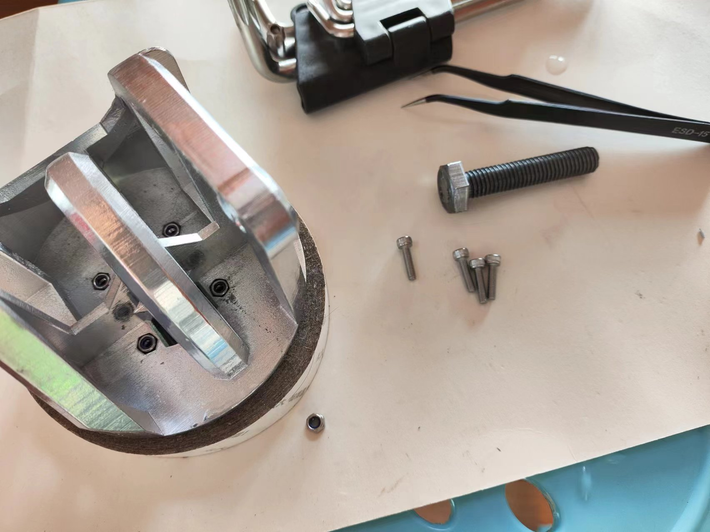

# 基于ESP32的四轴机械臂
>本项目基于**小智&阿奇联合出品 海豚机械臂**开源学习
>
>原项目地址：[机械臂数字孪生项目](https://x509p6c8to.feishu.cn/docx/FeMndRrzRommxGxTkFscJ0zKnKh)
>
>在此感谢原项目作者小智，阿奇的杰出工作
## 项目预览

## 项目职责
* 设计机械臂结构，包括**固定底座，旋转底座，连杆机构，夹爪机构**
* 3D打印零部件，并进行机械组装
* 绘制主控板，包括**供电，控制器，串口，排针等等**
* 编写机械臂控制代码，包括**舵机驱动代码，蓝牙模块代码**
* 机械臂运动学算法，**正逆运算**
***
## 关于结构设计
逆向工业型机械臂ABB-irb-460，得出机械臂运动原理，是由两个平行四边形的连杆机构使得D轴始终与地面垂直，确定了设计框架
### 逆向工程

### 平行四边形法则

### A轴 固定底座设计
>**需求：**
>
>旋转机构，将舵机安装在固定底座内，设计它们之间的驱动，考虑如何将舵机线通过A轴
>
>**解决：**
>
>轴承的外圈固定在固定底座上，轴承的内圈与旋转底座相连；
>大同步带轮与小同步带轮之间通过同步带驱动；
>用轴间螺丝，防松螺母将两个轴承连接起来；
>在大轴承的内部设计一个过线孔；
>
### A轴 固定底座预览


### B轴 旋转底座设计
>**需求：**
>
>旋转底座与固定底座连接，舵机如何驱动BC连杆与C轴连杆，BC连杆与C轴连杆的旋转机构，舵机如何安装
>
>**解决：**
>
>采用螺丝或螺母连接；
>C轴摇杆驱动，圆舵盘直连；
>BC连杆驱动需要一定的刚性，设计为一字舵盘连轴器；
>深沟球轴承，螺丝与螺母固定，BC连杆采用双臂结构以增加刚性；
>
### B轴 旋转底座预览


### 旋转底座中枢机构比较复杂，容易报错，需细心处理


### C轴部分 连杆机构
>**需求：**
>
>CD连杆，三角形连杆的外形尺寸，C轴机构的设计，BC，CD，三角形连杆之间的配合，连杆之间的旋转机构
>
>**解决：**
>
>采用平行四边形结构
>
### C轴 连杆机构预览


### 连杆机构中枢机构比较复杂，容易报错，需细心处理


### D轴部分 夹爪机构
>**需求：**
>
>夹爪与CD连杆，上水平连杆之间的连接，能夹取一些放置在桌面的小物品，能夹多大的，夹取动作结构，动力来源
>
>**解决：**
>
>动力来源采用双齿轮结构；
>夹取方式为旋转手指，对称结构；
>夹取直径大概3cm左右；
>
### D轴部分 夹爪机构预览


***
## 关于机械组装
通过以上的机械设计，再进行一些细节优化后，四轴机械臂的完全体组装完毕
### 机械臂完全体


紧接着，导出四轴机械臂装配体零部件
### 机械臂装配体零部件

3D打印后，进行手动喷漆，组装
### 机械臂手动组装




***
## 关于主控板绘制
### 原理图设计如下

### PCBlayout

### 板子查看

***
## 关于控制代码的编写
编写Arduino，开发环境为VScode，下载PlatformIO插件，用于标准库开发ESP32项目
### 舵机驱动控制
机身采用3个MG996R舵机，夹爪采用SG90舵机，舵机的驱动原理是发送PWM信号，通过改变占空比驱动舵机的转动角度

PWM(Pulse Width Modulation)脉冲宽度调制，在具有惯性的系统中，可以通过一系列脉冲的宽度进行调制，来等效的获得所需模拟参量，常应用于电机控速领域

常用调制方法为通过定时器输出比较功能，通过设置PSC，ARR，CCR寄存器的值来调制一个频率可调，占空比受CCR控制的PWM波形

此处由于引入了ESP32Servo标准库，可以直接用舵机标准库函数对舵机角度进行控制
```      
#include <ESP32Servo.h>               //引入舵机标准库函数

Servo servo;                          //定义舵机变量
servo.setPeriodHertz(50);             //舵机频率初始化函数;
servo.attach(servo_pin,500,2500);     //舵机的初始化参数配置，已对引脚进行配置,参数为引脚，最小微秒，最大微秒
servo.write(45);                      //舵机角度控制函数,参数为舵机角度
//注意，此处只做简单展示，详细代码请看控制代码
```
单舵机的控制较为简单，引入多舵机后需要分别控制各个舵机的角度，可以利用定时器定时功能，每隔一段时间进行一次角度判断函数，当舵机的set和now不同时，舵机转动，并且每转动一次对now加以修正
所以只需要对set值修改就可以驱动舵机转动到相应角度，同时，定时器计时频率可以改变舵机的转动速度，实现多舵机的速度控制
```           
#include <Ticker.h>              //引入定时器功能

struct SERVO                     //定义舵机结构体
{
    Servo engine[4];             //定义舵机变量参数
    uint8_t now[4];              //定义舵机当前角度参数   
    uint8_t set[4];              //定义舵机设置角度参数
};
SERVO servo_engine;              //定义舵机结构体变量
Ticker timer;                    //定义定时器变量

void Servo_Init()                //定义舵机初始化函数，对舵机频率初始化，参数引脚初始化
void Servo_back()                //定义舵机归位函数，机械设计时设计每个舵机的初始值，上电后自动执行复位功能
void timer_speed(uint8_t x)      //舵机速度控制函数，原理是利用定时器定时功能，每隔一段时间进行一次角度判断函数
void timer_back()                //定义舵机now修正函数，在舵机运动到指定位置后，修正now为当前值，避免一直运动
uint8_t Servo_run(uint8_t x,uint8_t set_angle,uint8_t now_angle)         //定义舵机驱动函数，当set和now不同时，舵机驱动
void Servo_motor_run(uint8_t a,uint8_t b,uint8_t c,uint8_t d)         //定义多舵机控制函数，给set值
//注意，此处只做简单展示，详细代码请看控制代码
```
### 多舵机控制

### 蓝牙模块编写
采用蓝牙模块，由于项目与控制端距离近，控制方便简单，故此处采用BLE(低功耗蓝牙)
在BLE通信模式中，存在两类设备：BLE服务端和BLE客户端，通信时，BLE服务端向外发送信号，可以被附件BLE客户端发现，一个BLE客户端可以连接特定的服务端，然后读取服务端发送的信号数据
BLE不但支持点对点传输，还支持广播模式，还可以组建Mesh网络
```
#include <BLEDevice.h>
#include <BLE2902.h>              //引进相关蓝牙通讯协议

#define SERVICE_UUID "4fafc201-1fb5-459e-8fcc-c5c9c331914b"
#define CHARACTERISTIC_UUID "beb5483e-36e1-4688-b7f5-ea07361b26a8"       //完整的128位UUID码

BLECharacteristic *pCharacteristic = NULL;            //创建特征Characteristic
bool bleConnected = false;                            //定义布尔型变量用于判断蓝牙是否连接

class bleServerCallbacks : public BLEServerCallbacks                     //Server回调函数声明，并用串口打印设备的连接状况
class bleCharacteristicCallbacks : public BLECharacteristicCallbacks      //客户端回调函数声明，用于客户端读取事件和写入事件
void BLE_Init()                   //定义初始化蓝牙函数，创建BLE蓝牙设备，创建服务器，设置设备的模式为BLE Server，创建服务，启动服务并开启广播
//注意，此处只做简单展示，详细代码请看控制代码
```
### 手机蓝牙控制

***
## 关于运动学算法
由于机械臂机械设计结构原因，舵机无法实现自由转动，受到结构限制

此处采用正逆运算解决运动学问题，正向运动学：给定机器人各关节变量，计算机器人末端的位置姿态，逆向运动学：已知机器人的末端位置姿态，计算机器人各关节的变量
假设各轴角度为A,B,C,D；各舵机角度为A_,B_,C_,D_；

通过机械结构和正逆运算，得到以下结论
>A轴：
>
>0 < A_ < 180; 0 < A < 70; A = A_ / (72/28)
>
>B轴：
>
>0 < B_ < 80; 0 < B < 80; B = B_
>
>C轴：
>
>140 - B_ < C_ < MIN(180,196-B_); 43.5 < C < MIN(83.5,95.5); C = B + C_ -96.5
>
>D轴：
>
>0 < D_ < 37.5; 0 < G < 29; G = G_/(22/17)

***
>再次感谢原项目作者小智，阿奇的杰出工作
>
>同时也欢迎大家一起来学习
>
***
后面会继续更新，请等待...
